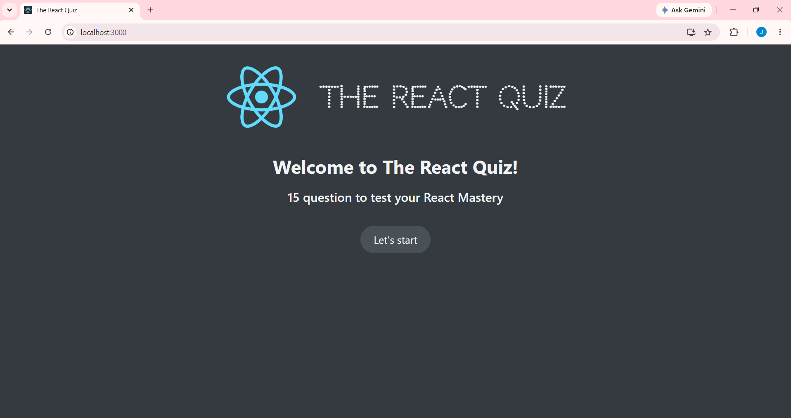
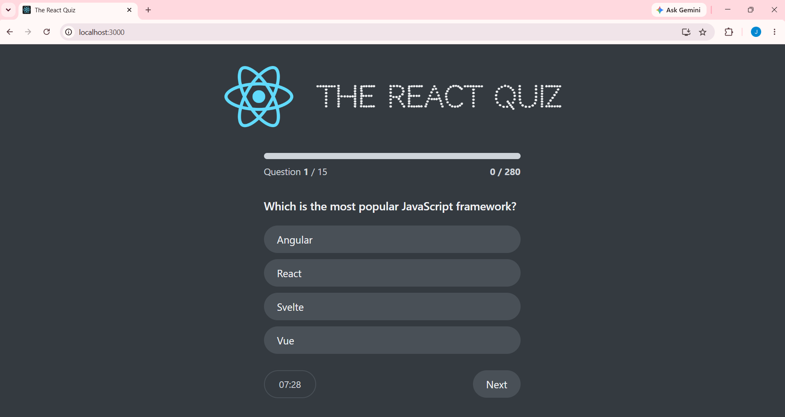
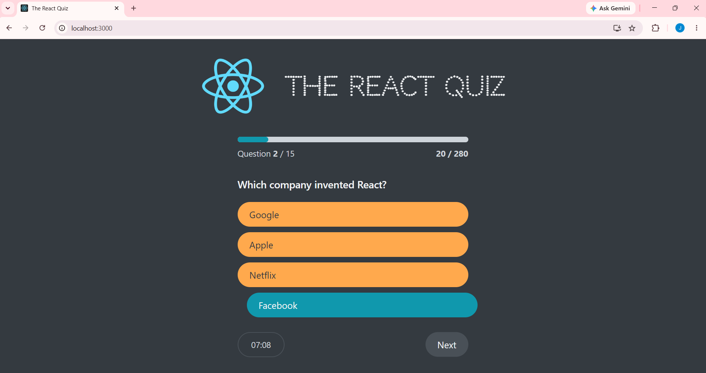
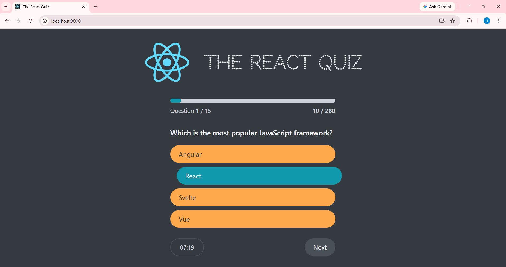
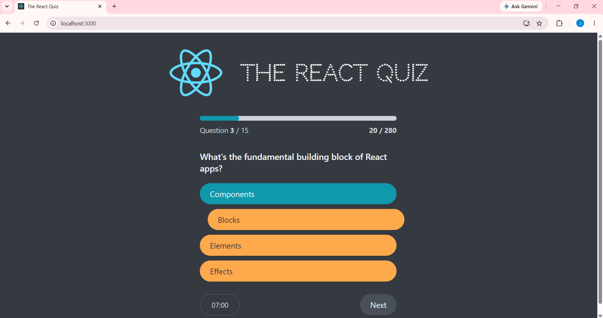
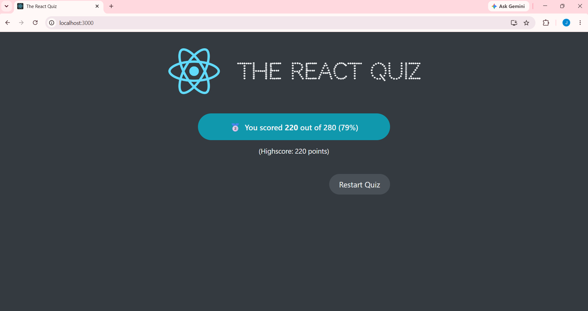
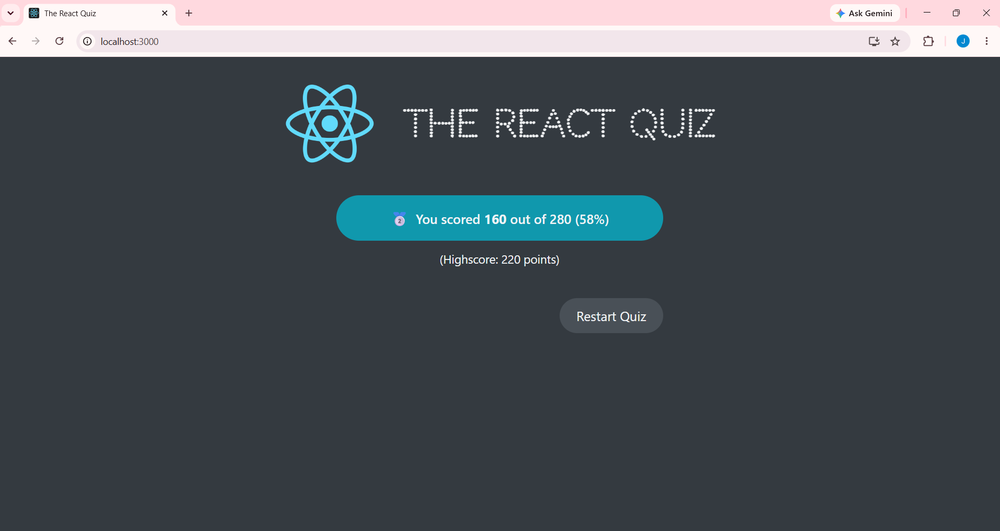
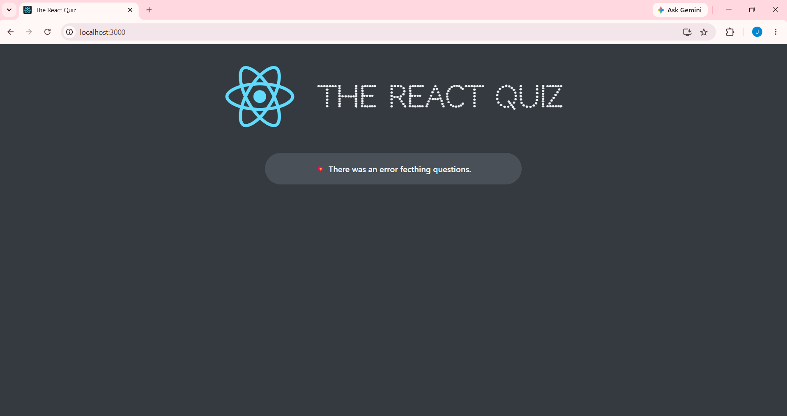

# The React Quiz ⚛️

## 📖 Description
The React Quiz is an interactive, timed web application designed to test a user's knowledge of React.js. 

**Architectural Focus:** This project was primarily built to demonstrate advanced state management in React using the `useReducer` hook. Rather than managing a messy web of individual `useState` variables, the entire application's logic (fetching data, tracking points, progressing the index, managing the timer, and recording high scores) is centralized within a single, predictable reducer function.

```
javascript
function reducer(state, action) {
  switch (action.type) {
    case "dataReceived":
      return { ...state, questions: action.payLoad, status: "ready" };
    case "dataFailed":
      return { ...state, status: "error" };
    case "start":
      return { ...state, status: "active", secondsRemaining: state.questions.length * SECS_PER_QUESTION };
    case "newAnswer":
      const question = state.questions.at(state.index);
      return {
        ...state,
        answer: action.payLoad,
        points: action.payLoad === question.correctOption ? state.points + question.points : state.points,
      };
    case "nextQuestion":
      return { ...state, answer: null, index: state.index + 1 };
    case "finish":
      return {
        ...state,
        status: "finished",
        highscore: state.points > state.highscore ? state.points : state.highscore,
      };
    case "restart":
      return { ...initialState, questions: state.questions, status: "ready", highscore: state.highscore };
    case "tick":
      return {
        ...state,
        secondsRemaining: state.secondsRemaining - 1,
        status: state.secondsRemaining === 0 ? "finished" : state.status,
      };
    default:
      throw new Error("Unknown Action");
  }
}
```

## 🚀 Features
* **Global Timer:** A countdown timer automatically calculates total time based on the number of questions and finishes the quiz if it hits zero.
* **Dynamic Progress Tracking:** A visual progress bar updates instantly alongside the user's current score and question index.
* **Instant Visual Feedback:** Color-coded UI highlights the correct answer and the user's selected answer upon submission.
* **Persistent High Scores:** The application retains the maximum score achieved across multiple playthroughs.
* **Robust Error Handling:** Custom error states gracefully handle failed API or database fetches.

## 🛠️ Built With
* React 
* Advanced Hooks (`useReducer`, `useEffect`)
* CSS Modules / Vanilla CSS

## 💻 Visual Walk-through

<p align="center">
<b>Start Screen:</b> <br/>
The initial UI state welcoming the user and establishing the question count.<br/>

<br />
<br />
<b>Active Gameplay:</b> <br/>
The main interface displaying the active question, timer, and dynamic progress bar.<br/>

<br />
<br />
<b>Live Progression:</b> <br/>
State updates continuously track the remaining time and cumulative score as the user progresses.<br/>

<br />
<br />
<b>Answer Validation (Correct):</b> <br/>
Dispatching a new answer triggers UI changes, confirming the right choice and updating points.<br/>

<br />
<br />
<b>Answer Validation (Incorrect):</b> <br/>
If the user guesses wrong, the UI identifies their mistake while revealing the correct solution.<br/>

<br />
<br />
<b>Quiz Completion:</b> <br/>
The final state calculates the percentage score, displays the result, and logs the Highscore.<br/>

<br />
<br />
<b>Highscore Retention:</b> <br/>
Upon restarting, the global state resets the board but intelligently preserves the user's highest historical score.<br/>

<br />
<br />
<b>Error Handling:</b> <br/>
Graceful fallback UI if the application fails to fetch the question data.<br/>

</p>
Graceful fallback UI if the application fails to fetch the question data.<br/>

</p>
